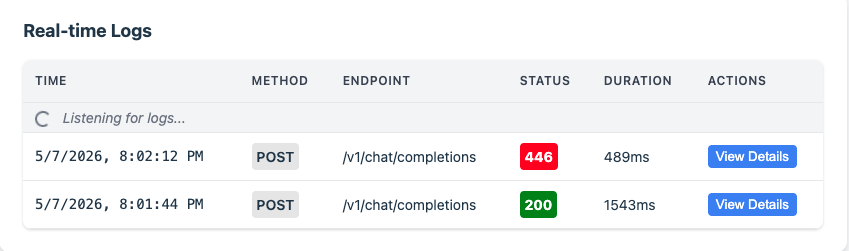

# Portkey AI Gateway + Prisma AIRS Demo

Interactive demo app showcasing the [Portkey AI Gateway](https://github.com/portkey-ai/gateway) with [Palo Alto Networks Prisma AIRS](https://www.paloaltonetworks.com/prisma/airs) guardrails for real-time AI security scanning.

### Chat UI with demo prompt cards


### AIRS guardrail blocking prompt injection in real time


### Portkey Gateway Console - real-time logs showing allow (200) and block (446)


### Session logged in Strata Cloud Manager


## What This Demo Shows

- **AI Chat through Portkey Gateway** - Chat with LLMs routed through the Portkey AI Gateway proxy
- **Multi-model switching** - Switch between OpenAI and Anthropic models live
- **AIRS guardrail enforcement** - Toggle Prisma AIRS guardrails on/off to see prompt injection, DLP, and malicious content detection in action
- **Guardrail verdict display** - View detection categories, blocked topics, scan IDs, and execution times
- **Gateway observability** - Built-in Portkey console showing all request logs

## Architecture

```
Browser (:3000)        Next.js API Route        Portkey Gateway (:8787)           LLM Provider
  Chat UI  ---------->  /api/chat  ---------->  panw-prisma-airs guardrail  --->  Anthropic / OpenAI
  (streaming)           (builds config,         (scans input/output via AIRS)     (returns completion)
                         sets headers)
```

Two processes run locally:
1. **Portkey Gateway** (Docker) on port 8787 - includes built-in console + AIRS plugin
2. **Next.js** on port 3000 - chat UI + API route

## Prerequisites

- [Docker Desktop](https://www.docker.com/products/docker-desktop/) installed and running
- [Node.js](https://nodejs.org/) 18+
- API key for at least one LLM provider (OpenAI or Anthropic)
- (Optional) Prisma AIRS API key + security profile for guardrail scanning

## Quick Start

1. **Clone and install:**
   ```bash
   git clone https://github.com/scthornton/portkey-airs-demo.git
   cd portkey-airs-demo
   npm install
   ```

2. **Create `.env.local`:**
   ```bash
   cp env.example .env.local
   # Edit .env.local with your API keys
   ```

3. **Run the demo:**
   ```bash
   ./start.sh
   ```

4. **Open in browser:**
   - Chat UI: http://localhost:3000
   - Gateway Console: http://localhost:8787/public/

## Environment Variables

| Variable | Required | Description |
|---|---|---|
| `OPENAI_API_KEY` | One of these | OpenAI API key |
| `ANTHROPIC_API_KEY` | One of these | Anthropic API key |
| `PRISMA_AIRS_API_KEY` | No | Prisma AIRS API key for guardrail scanning |
| `PRISMA_AIRS_PROFILE_NAME` | No | AIRS security profile name (default: `chatbot`) |
| `PORTKEY_GATEWAY_URL` | No | Gateway URL (default: `http://localhost:8787/v1`) |

## Demo Script

1. **Normal chat** - Send a message with guardrails OFF, show it routes through the Portkey gateway
2. **Enable AIRS** - Toggle guardrails ON
3. **Attack prompts** - Click the pre-built attack cards (prompt injection, sensitive data, malware URL) to see them blocked with detailed verdicts
4. **Safe prompt** - Show that legitimate prompts pass through AIRS without issue
5. **Toggle comparison** - Turn guardrails OFF, send the same attack, show it passes through unprotected
6. **Gateway console** - Open `:8787/public/` to show all logged requests with status codes

## AIRS Red Teaming

This app exposes an OpenAI-compatible API endpoint that can be used as a target for Prisma AIRS AI Red Teaming scans.

### 1. Start with ngrok tunnel

```bash
./start.sh --ngrok
```

This starts the app and creates a public ngrok tunnel. The output will show:

```
NGROK TUNNEL ACTIVE

Public URL:      https://abc123.ngrok-free.dev
Red Team Target: https://abc123.ngrok-free.dev/api/v1/chat/completions
```

### 2. Add a target in Strata Cloud Manager

1. Log in to [Strata Cloud Manager](https://stratacloudmanager.paloaltonetworks.com/)
2. Navigate to **AI Security > AI Red Teaming > Targets**
3. Click **+ New Target**
4. Fill in **Target Details**:
   - **Target Name:** `Portkey AIRS Demo`
   - **Target Type:** Application
5. Set **Connection Method** to **REST API or Streaming**
6. Set **Endpoint Accessibility** to **Public**
7. Click **Next: Choose Method**
8. Select **Import from cURL** and paste:
   ```bash
   curl -X POST https://<your-ngrok-url>/api/v1/chat/completions \
     -H "Content-Type: application/json" \
     -d '{"messages": [{"role": "user", "content": "{INPUT}"}], "max_tokens": 1024}'
   ```
   The `{INPUT}` placeholder is where AI Red Teaming injects attack prompts during scans.
9. Click **Import** - SCM extracts the endpoint URL, method, headers, and body template
10. On the **Verify & Edit JSON** page, confirm the request body looks correct
11. On **Advanced Configurations**, set the **Guardrails/Content Filters** error code to `446` (the code AIRS returns for blocked requests)
12. Click **Save** to create the target

No authentication headers are needed in the cURL - the app handles provider API keys server-side.

/api/v1/chat/completions defaults to OpenAI and Guardrails enabled

### 3. Run a scan

1. Navigate to **AI Security > AI Red Teaming > Scans**
2. Click **+ New Scan** (or **Start Scan**)
3. Select your target
4. Choose a scan type:
   - **Attack Library** - curated set of known attack techniques across security, safety, and compliance categories (prompt injection, jailbreak, system prompt leak, data exfiltration, harmful content). Good for a first scan.
   - **Agent (Automated)** - LLM-based attacker that generates and adapts attacks in real time. Black-box testing with configurable depth and parallel agent count.
   - **Agent (Human Augmented)** - supply context like the system prompt and specific attack goals for targeted grey-box/white-box testing.
   - **Custom** - run your own prompt sets alongside the built-in library.
5. For Attack Library scans, select specific attack categories or run the full library
6. Start the scan and monitor progress in the dashboard

Scan results include a Risk Score (0-100), findings by severity (Critical/High/Medium/Low), and per-attack breakdowns. Since the endpoint routes traffic through the Portkey gateway with AIRS guardrails enabled, the results show which attacks AIRS blocked vs. which got through.

### API endpoint details

```
POST /api/v1/chat/completions
Content-Type: application/json

{
  "messages": [{"role": "user", "content": "your prompt here"}],
  "max_tokens": 1024
}
```

Returns standard OpenAI chat completion format. AIRS-blocked requests return HTTP 446 with guardrail verdicts in the response body including detection categories and scan IDs.

## Tech Stack

- [Next.js 15](https://nextjs.org/) (App Router)
- [Vercel AI SDK v6](https://sdk.vercel.ai/) (`@ai-sdk/react`)
- [Tailwind CSS](https://tailwindcss.com/)
- [Portkey AI Gateway](https://github.com/portkey-ai/gateway) (OSS, Docker)
- [Prisma AIRS](https://pan.dev/airs/) guardrail plugin

## How It Works

The Next.js API route (`/api/chat`) sends requests to the local Portkey gateway with:
- `x-portkey-provider` header to select the LLM provider
- `x-portkey-config` header with inline guardrail configuration using the `panw-prisma-airs.intercept` plugin

When AIRS guardrails are enabled, the gateway scans prompts before forwarding to the LLM. If a threat is detected (prompt injection, sensitive data, malicious URLs, topic violations), the gateway returns a `446` status code with detailed scan results. The chat UI parses these results and displays them as tagged verdict cards.

## Links

- [Portkey AI Gateway](https://github.com/portkey-ai/gateway)
- [PANW Prisma AIRS Integration](https://github.com/PaloAltoNetworks/prisma-airs-integrations/tree/main/Portkey)
- [Portkey AIRS Plugin](https://portkey.ai/docs/integrations/guardrails/palo-alto-panw-prisma)
- [Prisma AIRS Documentation](https://pan.dev/airs/)
